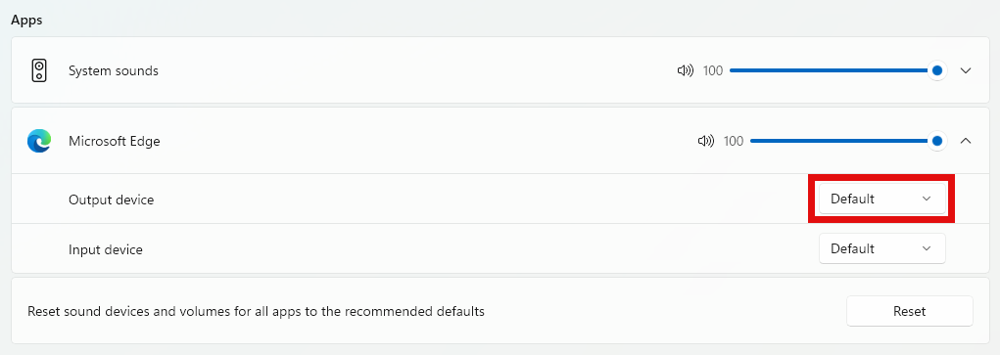
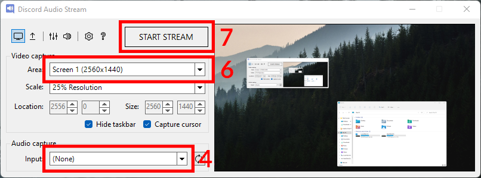

# Discord Audio Stream

Windows utility that allows Discord to stream (with audio!) the entire desktop or a specific window (including an OBS composition).

Made out of necessity and continuous frustration. Built with WinForms (C#).

    

    
    
     
    
    
    

## Who is this for?

If you use Discord regularly, you may be used to screen-sharing (streaming) a specific window. You may also have tried to stream the entire screen, only to realize that your friends cannot hear any audio from your desktop.

Similarly, you may be an advanced user who wants to step up your Discord streams by using OBS. While you can stream the OBS video output easily, it's not possible to stream the audio without configuring an advanced audio setup.

If any of these are true, this tool may be for you.

## Does it only work for Discord?

Not at all, you can use this tool with any video conferencing software that allows screen-sharing a specific window.

However, keep in mind that this utility has been built and tested only for Discord, so some of the steps below will be different and you may encounter errors.

## Does it only work on Windows?

Yes, this program uses Windows APIs that are not available on MacOS or Linux.

## Why is it licensed under GPLv3?

This program is a fork of [quick-screen-recorder](https://github.com/ModuleArt/quick-screen-recorder), by [ModuleArt](https://github.com/ModuleArt), which is licensed under the GPLv3 license.

Unfortunately, GPLv3 forces any derivative work to also be licensed under GPLv3, which means I'm unable to offer a more permissive license.

# How do I use it?

First, download the program from the [GitHub releases page](https://github.com/p-rivero/DiscordAudioStream/releases). You should be able to execute it directly without installing anything.

The following steps depend on what you want to do.

<b>Stream the entire desktop with audio</b>

 

1. Decide for which programs you want to actually share the audio.

    **Tip:** your answer should never be *"all of them"*. You should, at least, exclude Discord (otherwise, the viewers of your stream will hear themselves).
    
    > **Update:** Discord now seems to create 2 outputs: one for the call audio (voices of the call members) and another for the media audio (videos sent in a text channel). This means that you are now able to stream the Discord window (for example, to group watch videos from a text channel) without the viewers hearing themselves. You need to determine which of the 2 outputs is the media audio and only share that one (do not include the call audio).
    
2. Open the volume mixer. You can do this from the DiscordAudioStream window by using `Ctrl+V` or clicking the mixer icon: .

3. *For each* of the programs whose audio you want to share, change its *output* device from "Default" to another device (that you are not currently using). For example, if you have Steam installed you should have a virtual audio device called "Steam Streaming Speakers" that you can use (unless you are using it for other purposes).

    - Set the output of *all* the desired programs to **the same** audio device.
    - Don't worry if you stop hearing the audio from the programs you are sharing. Later you will be able to hear them again.
    - Make sure that there are no other programs outputting audio to the device you selected. Everything that gets output to this device will be shared.

     
    

    
I want to use an audio capture card

        Capture cards and microphones are audio input devices, but DiscordAudioStream only shows output devices by default. Open DiscordAudioStream settings > Debug and enable "Show audio input devices". You should now see your capture cards and microphones in the audio capture dropdown with the <code>[IN]</code> prefix.
         
        Keep in mind that Discord already shares your microphone when you enter a call, so you don't need to capture it in DiscordAudioStream.
    

     
    

    
I don't have any unused audio device!

        You can use <a href="https://vb-audio.com/Cable/">VB-CABLE</a>, which creates 2 virtual audio devices: <code>CABLE Input</code> (virtual output device) and <code>CABLE Output</code> (virtual microphone). Set the output of the programs you want to capture to <code>CABLE Input</code> and try to capture <code>VB-Audio Virtual Cable</code> in DiscordAudioStream (see step 4 below).
         
        When you start capturing the audio in step 7, you may encounter an error. If this happens, you will need to open DiscordAudioStream settings > Debug and enable "Show audio input devices". Go to the audio capture dropdown and capture <code>[IN] VB-Audio Virtual Cable</code> instead.
    

     
    
    

4. In the *Audio capture input* dropdown, select the (previously unused) audio device that you have chosen in step 3.

5. (Optional) In the upcoming steps we will create a new window with the same size as the screen you are sharing. In order to make its size more manageable, you may want to change the *Video capture scale* dropdown to 50%.

6. In the *Video capture area* dropdown, select the screen you want to share.

7. Click the *Start Stream* button. This will create a new window. You should now be able to hear the audio from the programs you stopped hearing in step 3.

8. In Discord, select "Share Your Screen". This will show a list of open windows. Select the window called "Discord Audio Stream" (the one that was created in step 7).

    - In DiscordAudioStream settings, you can change the *Stream title* (the default value is "Discord Audio Stream"). If you have changed this setting, select the window with the title you have chosen instead. Discord usually doesn't show this title to the viewers, so you can set it to something like "⚠️THIS WINDOW⚠️" to make finding the window easier.

9. You are now sharing your screen with the audio from the selected programs. When you are done, you can close DiscordAudioStream.

    - **Very important:** remember to restore the output device of your programs to "Default". Otherwise, you won't be able to hear their audio.
    - Keep in mind that if you minimize the window that was created in step 7, your Discord stream will probably be paused. You may want to hide this window behind other windows, without minimizing it.

    

 

<b>Stream to Discord using OBS</b>

 

First, follow steps 1-4 above (expand the "Stream the entire desktop with audio" dropdown).

> **Important:** the program for which you want to share the audio **is NOT** OBS (OBS doesn't actually output any audio). Instead, you must identify which programs you are recording and share their audio (change their output device) separately.
> 
> For example, if you have added the following sources to your OBS composition:
> - The game you are playing
> - Your webcam + microphone
> - Stream alerts (with audio), using Google Chrome
> 
> Then, the programs for which you want to share the audio are 1. the game and 2. Google Chrome. Do not worry about the microphone, since Discord already shares it when you enter a call.

Now follow this steps:

5. In OBS, right-click the preview and select "Windowed Projector (Preview)". This will create a new window. You can now minimize OBS (but not the preview window). You may want to make this window slightly bigger, in order to improve video quality.

6. Open DiscordAudioStream (this program). In the *Video capture area* dropdown, select the window "Windowed Projector (Preview)" (the one that was created in step 5).

7. Click the *Start Stream* button. This will create a new window. You should now be able to hear the audio from the programs you stopped hearing in step 3.

8. In Discord, select "Share Your Screen". This will show a list of open windows. Select the window called "Discord Audio Stream" (the one that was created in step 7).

    - In DiscordAudioStream settings, you can change the *Stream title* (the default value is "Discord Audio Stream"). If you have changed this setting, select the window with the title you have chosen instead. Discord usually doesn't show this title to the viewers, so you can set it to something like "⚠️THIS WINDOW⚠️" to make finding the window easier.

9. You are now sharing your OBS composition with the audio from the selected programs. When you are done, you can close DiscordAudioStream.

    - **Very important:** remember to restore the output device of your programs to "Default". Otherwise, you won't be able to hear their audio.
    - Keep in mind that if you minimize the window that was created in step 7, your Discord stream will probably be paused. You may want to hide this window behind other windows, without minimizing it.

 

---

## Changing the capture method

You can change which API is used for capturing video by going to Settings  > Capture.

Read [this document](/docs/CaptureMethods.md) for more information about the pros and cons of each method. 

## Reporting a bug/crash

If the program crashes, it will attempt to generate a trace file called `DiscordAudioStream_stack_trace.txt`. This file will be located in the same folder as your executable (`DiscordAudioStream.exe`).
Create a [new issue](https://github.com/p-rivero/DiscordAudioStream/issues/new) and make sure to attach your trace file to help me solve your crash more easily.

If the stack trace is not generated automatically, go to Settings  > Debug and enable *Output log file*.
Close and reopen the program for this change to take effect.

When this option is active, your actions inside the program are logged to a file called `DiscordAudioStream_log.txt` (also located in the same folder as the executable).
Reproduce the crash (with the least number of steps, if possible) and send me the log file to help me locate the source of the crash. 

> **Privacy notice:** The logged information may include your Windows version, the resolution of your screen(s) and the name of the audio devices you are using. For privacy reasons, the titles/names of your opened windows/programs are **NOT** logged. The captured video/audio is **NOT** logged either. 
> 
> The logs never leave your computer unless you send them to me on GitHub, so feel free to read them before sending them and manually remove any unwanted information.
