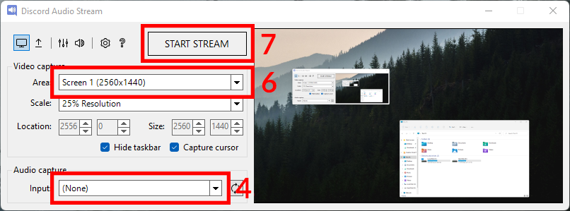

# Discord Audio Stream

Windows utility that allows Discord to stream (with audio!) the entire desktop or a specific window (including an OBS composition).

Made out of necessity and continuous frustration. Built with WinForms (C#).

    

    
    
    
    

## Who is this for?

If you use Discord regularly, you may be used to screen-sharing (streaming) a specific window. You may also have tried to stream the entire screen, only to realize that your friends cannot hear any audio from your desktop.

Similarly, you may be an advanced user who wants to step up your Discord streams by using OBS. While you can stream the OBS video output easily, it's not possible to stream the audio without configuring an advanced audio setup.

If any of these are true, this utility may be for you.

## Does it only work for Discord?

Not at all, you can use this utility with any video conferencing software that allows screen-sharing a specific window.

However, keep in mind that this utility has been built and tested only for Discord, so some of the steps below will be different and you may encounter errors.

## Does it only work on Windows?

Yes, this program uses Windows APIs that are not available on MacOS or Linux.

## Why is it licensed under GPLv3?

This program is a fork of [quick-screen-recorder](https://github.com/ModuleArt/quick-screen-recorder), by [ModuleArt](https://github.com/ModuleArt), which is licensed under the GPLv3 license.

Unfortunately, GPLv3 forces any derivative work to also be licensed under GPLv3, which means I'm unable to offer a more permissive license.

# How do I use it?

First, [download](https://github.com/p-rivero/DiscordAudioStream/releases) and extract the program. You should be able to execute it directly without installing anything.
  
The following steps depend on what you want to do.

---

**Stream the entire desktop with audio:**

1. Decide for which programs you want to actually share the audio.

    **Tip:** your answer should never be *"all of them"*. You should, at least, exclude Discord (otherwise, the viewers of your stream will hear themselves).
    
2. Open the volume mixer. You can do this from the utility by using `Ctrl+V` or clicking the mixer icon: .

3. *For each* of the programs whose audio you want to share, change its *output* device from "Default" to another device (that you are not currently using). For example, if you have Steam installed you should have a virtual audio device called "Steam Streaming Speakers" that you can use (unless you are using it for other purposes).

    - Set the output of *all* the desired programs to **the same** audio device.
    - Don't worry if you stop hearing the audio from the programs you are sharing. Later you will be able to hear them again.
    - Make sure that there are no other programs outputting audio to the device you selected. Everything that gets output to this device will be shared.

    

4. In the *Audio capture input* dropdown, select the (previously unused) audio device that you have chosen in step 3.

5. (Optional) In the upcoming steps we will create a new window with the same size as the screen you are sharing. In order to make its size more manageable, you may want to change the *Video capture scale* dropdown to 50%.

6. In the *Video capture area* dropdown, select the screen you want to share.

7. Click the *Start Stream* button. This will create a new window. You should now be able to hear the audio from the programs you stopped hearing in step 3.

8. In Discord, select "Share Your Screen". This will show a list of open windows. Select the window called "Discord Audio Stream" (the one that was created in step 7).

9. You are now sharing your screen with the audio from the selected programs. When you are done, you can close the utility.

    - **Very important:** remember to restore the output device of your programs to "Default". Otherwise, you won't be able to hear their audio.
    - Keep in mind that if you minimize the window that was created in step 7, your Discord stream will probably be paused. You may want to hide this window behind other windows, without minimizing it.

    
    
---

**Stream to Discord using OBS:**

First, follow steps 1-4 above.

> **Important:** the program for which you want to share the audio **is NOT** OBS (OBS doesn't actually output any audio). Instead, you must identify which programs you are recording and share their audio (change their output device) separately.
> 
> For example, if you have added the following sources to your OBS composition:
> - The game you are playing
> - Your webcam + microphone
> - Stream alerts (with audio), using Google Chrome
> 
> Then, the programs for which you want to share the audio are 1. the game and 2. Google Chrome. Do not worry about the microphone, since Discord already shares it when you enter a call.

Now follow this steps:

5. In OBS, right-click the preview and select "Windowed Projector (Preview)". This will create a new window. You can now minimize OBS (but not the preview window). You may want to make this window slightly bigger, in order to improve video quality.

6. Open the Discord Audio Stream utility (this program). In the *Video capture area* dropdown, select the window "Windowed Projector (Preview)" (the one that was created in step 5).

7. Click the *Start Stream* button. This will create a new window. You should now be able to hear the audio from the programs you stopped hearing in step 3.

8. In Discord, select "Share Your Screen". This will show a list of open windows. Select the window called "Discord Audio Stream" (the one that was created in step 7).

9. You are now sharing your OBS composition with the audio from the selected programs. When you are done, you can close the utility.

    - **Very important:** remember to restore the output device of your programs to "Default". Otherwise, you won't be able to hear their audio.
    - Keep in mind that if you minimize the window that was created in step 7, your Discord stream will probably be paused. You may want to hide this window behind other windows, without minimizing it.

---

## Common issues:

**When capturing a window, I only get a black screen:** Make sure you are on Windows 8.1 or later. You can also switch to another capture method in the Settings menu (press `Ctrl+,` or click the Settings button ).

**The captured window is flickering:** In some cases, the experimental capture method (active by default) can cause noticeable flickering. You can switch to another capture method in the Settings menu (press `Ctrl+,` or click the Settings button ).

**My issue is not listed here:** Please let me know in the [issues section](https://github.com/p-rivero/DiscordAudioStream/issues).